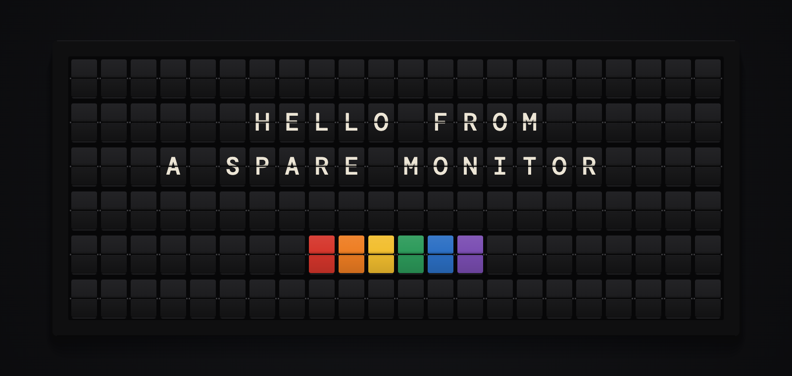
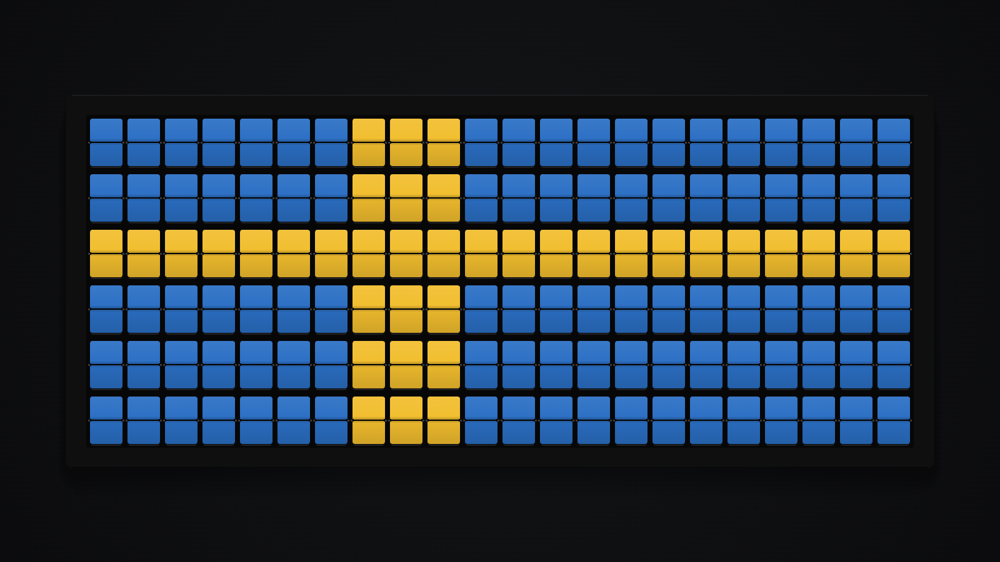
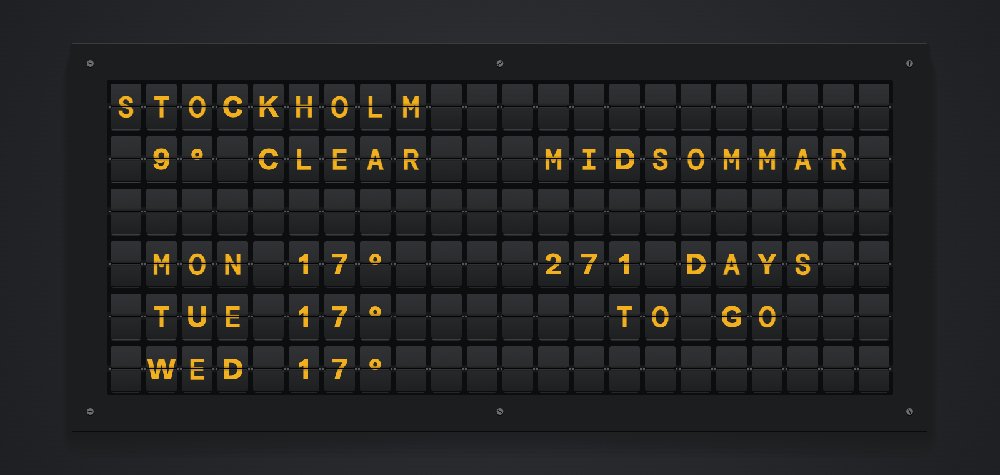

# Split-Flap Board

A free split-flap message board for any screen. Put a spare monitor on the wall, open the page, and it flips through your messages, the time, Stockholm public transport departures, the weather, electricity prices and countdowns, one letter at a time like a railway board.

**Live:** [maclaine.se/split-flap](https://maclaine.se/split-flap)



A [Vestaboard](https://www.vestaboard.com) costs thousands, and screen apps like it charge a monthly fee for each screen. This runs in a browser for nothing and needs no account. Every board lives in the browser that made it, and a board link carries it to another screen. If you want your boards on every device, you can sign in with Google, and they are kept with your account as well.

## What it does

- **A physical-looking board.** Each flap steps forward through the drum to its letter, folds over its hinge with light and shadow, and settles with a small rebound. Drawn on one canvas, so a Raspberry Pi keeps up.
- **Words:** messages with colour chips, rotating messages, big text drawn in colour chips, quotes, and menus with prices lined up on the right.
- **Time:** clock and date, a big clock, a word clock ("QUARTER PAST TEN", "KVART ÖVER TIO"), a letter clock where the words for the time light up in a grid of faint letters, countdowns that can also count up from a date, and Today, with the week number, Swedish red days and flag days, and sunrise and sunset.
- **Live:** SL departures for up to six stops in Storstockholms Lokaltrafik, or the home station you starred on the [Stockholm SL map](https://maclaine.se/en/stockholm-sl-map). Weather from Open-Meteo, electricity spot prices by price area, exchange rates, On this day from Wikipedia, and Follow a URL, which prints lines from any JSON or text address that lets other sites read it.
- **Pictures:** paint with the colour chips, turn a photo into chips in the browser, or run an animated pattern (Nordic flags, rain, waves, confetti).
- **Templates:** ten to start from, including Home dashboard, Station board, Café, Office lobby, Letter clock and Everything at once, which fills the screen and rolls every flap the long way round.
- **Layouts:** a page can be one zone or two (header and body, split, ticker row, or stacked halves for portrait screens), each showing a different channel.
- **Playlist:** pages rotate on their own timers. A page can have several times, by days of the week or on a date once or every year, and Show alone gives a page its time to itself (the train times on weekday mornings). Each page can have its own transition. Quiet hours dim or blank the board overnight.
- **Three themes** (Vestaboard Black, Vestaboard White, Solari Amber), any grid from 1 × 4 to 24 × 60, and four transitions at three speeds, previewed on the board as you pick them. Authentic rolls every flap the whole way round.
- **Four flap sounds** (Clack, Heavy, Soft, Tick), synthesised: a plastic tick for each flap and a ka-chunk when the last one lands.
- **The editor.** Each kind of content is a tile drawn as a small board in the shape of the zone it fills, so you see it before you pick it. On a wide screen the pages stay beside the editor as thumbnails you can drag to reorder. On a phone it goes one step at a time with the board above.
- **Messages are made on the grid** in Type, Paint or Photo mode, with undo and redo. A message you change is kept under Earlier messages in this browser.
- **Share by link or QR (Quick Response) code.** The link holds the whole board, compressed into the part of the URL after `#`, which browsers never send to a server. Save as image downloads the page as a PNG.
- **Made for walls:** kiosk mode (`?kiosk=1`), screen wake lock, a one pixel drift against burn-in, offline support, a small note when live data is getting old, and a reload in quiet hours when a new version is live. Every flap can roll once at start up and on the hour. `?bg=transparent` draws the board on nothing, for OBS.
- **Stereo flaps:** each flap's sound is panned by its column.
- English and Swedish. Å Ä Ö Æ Ø Ü É each have their own flap, and so does ♥.





## Accounts

An account is optional. Without one, boards live in the browser that made them, as they always have. Sign in with Google and they are kept with the account too, and come back on any device you sign in on. The browser stays the working copy, so the board runs offline and a wall screen never waits on the server. A board changed in two places keeps both versions. Wall screens use board links and never sign in.

The account stores the Google account id, the name, the email and the boards, in a Cloudflare D1 database in the EU. It keeps no IP addresses, browser details or Google tokens, and there are no analytics. Export my account and Delete account are in the editor. The full notice is [privacy.html](privacy.html), at [maclaine.se/en/split-flap/privacy](https://maclaine.se/en/split-flap/privacy).

The server is a Cloudflare Worker in [`worker/`](worker/), with its own dependencies and README. The app itself still has none.

## Put it on a monitor

**Raspberry Pi.** Install Raspberry Pi OS with desktop. Build your board on your phone, press Share, and open the link on the Pi with `?kiosk=1` added before the `#`. To start it at boot, add this to `~/.config/labwc/autostart` (Bookworm with Wayland; older releases call the browser `chromium-browser`):

```sh
chromium --kiosk --noerrdialogs --disable-infobars "https://maclaine.se/split-flap?kiosk=1#b=..."
```

Opening the same link at every boot is safe: a board with the same id replaces itself instead of piling up copies.

**Cast a tab** from Chrome to a Chromecast or Google TV, then press Fullscreen. **An old laptop** works too: turn off sleep, open the link, press F.

## Run your own copy

There is no build step and no dependencies. Any static file server will do:

```sh
git clone https://github.com/MMacLaine/split-flap.git
cd split-flap
python3 -m http.server 8801    # then open http://localhost:8801
```

Tests use Node's built-in runner: `npm test` (Node 18 or newer).

The SL station list in `data/sl-sites.json` is baked from SL's open site list; refresh it with `node _dev/fetch-sl-sites.mjs`.

## How it is built

| File | What it does |
|---|---|
| `src/renderer.js` | The canvas board: glyph atlas, fold, stagger, frame budget. Its constants are the design spec. |
| `src/charset.js` | The drum (74 flaps), typed text to flaps, Vestaboard character codes for import. |
| `src/content.js` | Layouts, zones and what each channel prints, as pure functions. |
| `src/almanac.js` | Week numbers, Swedish red days and flag days, sunrise and sunset. |
| `src/pixels.js` | The 3 × 5 pixel font and the animated colour patterns. |
| `src/templates.js` | The ready-made boards. |
| `src/sound.js` | The four synthesised flap sounds. |
| `src/schedule.js` | Page timers, time windows by day or date, Show alone, quiet hours. |
| `src/live.js` | The fetchers (SL, Open-Meteo, electricity, exchange rates, Wikipedia, Follow a URL), station and city search. |
| `src/store.js` | localStorage, board links, and the sanitizer every imported board goes through (the Worker uses it too). |
| `src/account.js` | Signing in, and keeping this browser's boards in step with the account. |
| `src/sync.js` | The sync rules as pure functions: merging, deletes, and whose boards are whose. |
| `worker/` | The accounts API: a Cloudflare Worker with D1 and Better Auth. |
| `privacy.html` | The privacy notice (the Swedish one is in `site/`). |
| `src/app.js` | Control bar, share, kiosk mode, and the board state the editor works on. |
| `src/editor.js` | The editor drawer: playlist, page, content picker, options, board settings, templates. |
| `src/catalogue.js` | The picker's tiles, their defaults and their option fields. |
| `src/composer.js` | Type, Paint and Photo on the grid, undo and redo, earlier messages. |
| `src/photo.js` | A photo to colour chips, with dithering. |

The visual design (tile anatomy, fold shading, themes, timing) came from a design pass documented in [`DESIGN-HANDOVER.md`](DESIGN-HANDOVER.md), with the prototype and spec sheet in [`design/`](design/). The editor came from a second pass, in [`DESIGN-HANDOVER-editor.md`](DESIGN-HANDOVER-editor.md) and [`design/editor/`](design/editor/). What might come next is in [`ROADMAP.md`](ROADMAP.md).

## Data and credits

- Departures: [SL](https://sl.se) through [Trafiklab](https://www.trafiklab.se).
- Weather and city search: [Open-Meteo](https://open-meteo.com), CC BY 4.0 (Creative Commons Attribution 4.0).
- Electricity prices: [elprisetjustnu.se](https://www.elprisetjustnu.se).
- Exchange rates: European Central Bank reference rates through [Frankfurter](https://frankfurter.dev).
- On this day: [Wikipedia](https://www.wikipedia.org), CC BY-SA 4.0 (Creative Commons Attribution-ShareAlike 4.0).
- Every source is keyless and read straight from your browser. Follow a URL only reads the addresses you give it.
- QR codes: [qrcode-generator](https://github.com/kazuhikoarase/qrcode-generator) by Kazuhiko Arase, MIT, vendored in `src/vendor/`.
- Fonts: DM Mono, Schibsted Grotesk, Plus Jakarta Sans and Cormorant Garamond, all SIL Open Font License 1.1.

QR Code is a registered trademark of DENSO WAVE INCORPORATED. Vestaboard is a trademark of Vestaboard, Inc.; this project is not affiliated with it.

## Licence

MIT. Made by [Matthew MacLaine](https://maclaine.se).
